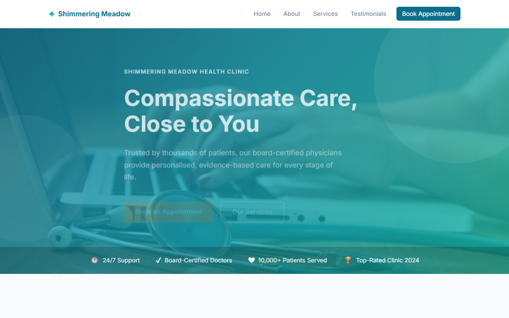

# Shimmering Meadow Health Clinic

A fully responsive, single-page healthcare website built with vanilla HTML, CSS, and JavaScript — no frameworks, no build step.

**Live site:** https://contentflowdigital321-cell.github.io/healthcare/



---

## Features

- **Sticky navigation** with smooth scroll and mobile hamburger menu
- **Hero section** with an illustrated meadow gradient and a signature grass illustration (no stock photo)
- **Stats band** — clinic-at-a-glance figures (patients served, satisfaction, specialties, experience)
- **About section** with two-column layout and clinic photo
- **Services grid** — six cards with photo thumbnails and hover zoom
- **Testimonials** — four patient reviews with real avatar photos
- **Lead magnet** — free preventive-care checklist opt-in with its own capture form
- **Enquiry form** with client-side validation (name, email, phone), inline field-level error messages, and live submission via FormSubmit.co
- **WhatsApp chat widget** — floating button with quick-reply suggestions that deep-link to `wa.me`
- **Fade-in on scroll** via `IntersectionObserver`
- Fully accessible — semantic HTML5, ARIA labels, keyboard-navigable, dark-section-aware focus rings

## Tech stack

| Layer | Technology |
|---|---|
| Markup | HTML5 |
| Styles | CSS3 (custom properties, CSS Grid, `@keyframes`) |
| Scripting | Vanilla JavaScript (ES6+) |
| Fonts | Google Fonts — Fraunces (headings) + Karla (body) |
| Photos | Unsplash CDN (scene photos), pravatar.cc (avatars) |
| Form backend | FormSubmit.co |
| Hosting | GitHub Pages |
| CI/CD | GitHub Actions |

## File structure

```
healthcare/
├── index.html          # All markup
├── style.css           # All styles (mobile-first)
├── script.js           # All JavaScript
├── screenshot.png      # Homepage screenshot (auto-generated)
├── scripts/
│   └── screenshot.js   # Playwright screenshot utility
└── .github/
    └── workflows/
        └── deploy.yml  # GitHub Actions deploy workflow
```

## Running locally

No server or install needed — open the file directly:

```bash
# Windows
start index.html

# macOS
open index.html

# Linux
xdg-open index.html
```

## Regenerating the screenshot

```bash
node scripts/screenshot.js
```

Requires Node.js — Playwright and Chromium are fetched automatically via `npx`.

## Deployment

The site deploys automatically to GitHub Pages on every push to `main` via [`.github/workflows/deploy.yml`](.github/workflows/deploy.yml).

To set it up in a fork:

1. Go to **Settings → Pages** in your repository
2. Set **Source** to **GitHub Actions**
3. Push to `main` — the workflow handles the rest

## Customisation

### Colours
All design tokens are CSS custom properties in the `:root` block at the top of `style.css` — see [`design-system/shimmering-meadow-health-clinic/MASTER.md`](design-system/shimmering-meadow-health-clinic/MASTER.md) for the full palette and rationale:

```css
:root {
  --meadow-800: #1F3D2B;
  --amber-700:  #92400E;
  --bg:         #F7F9F1;
}
```

### Photos
- **Hero background** — no stock photo; it's a CSS gradient plus the inline grass-signature SVG. Edit `.hero` and `.hero-botanical` in `style.css`/`index.html` to change it.
- **Service card photos** — replace the `src` on each `.service-img-wrap img` in `index.html`
- **About photo** — replace the `src` on `.about-image img` in `index.html`
- **Testimonial avatars** — replace the `src` on each `.avatar` in `index.html`

### Form submission
The enquiry form posts to a [FormSubmit.co](https://formsubmit.co) endpoint (`FORMSUBMIT_ENDPOINT` in `script.js`), which forwards submissions by email — no backend required. Update the endpoint address there if the destination email changes.

### WhatsApp widget
Replace the placeholder E.164 number in `data-whatsapp-number` on `#whatsapp-widget` (in `index.html`) with the clinic's real WhatsApp number before launch.
